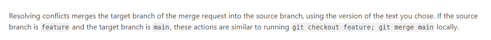

# gitlab错误合并

一次低版本向高版本合入，出现了conflicts，在gitlab界面上直接合并后，在低版本的代码中发现了高版本的代码，且出现了一个高版本向低版本的merge记录

由于合入的代码不多，且当时要发补丁包，没有太考虑这个问题是怎么发生的，我们直接revert掉了高版本的代码

后续在gitlab的官网上面找到了原因
https://docs.gitlab.com/ee/user/project/merge_requests/conflicts.html

在gitlab界面上解决冲突，如果是feature分支合入主分支，相当于check out feature分支，然后主分支merge到feature分支，再把feature分支合入到主分支

所以如果合并发生冲突，一定不要在gitlab的界面上合并，一定要在本地解决冲突，然后再提交merge request